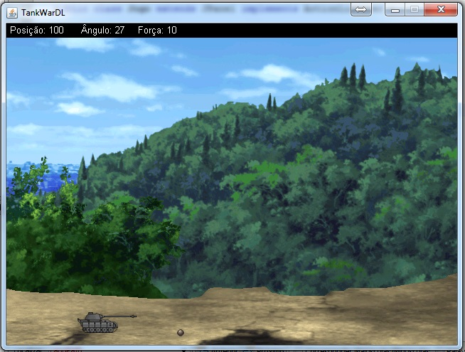

tankWar
=======

Este projeto foi desenvolvido na disciplina de redes 2 no curso de Ciência da Computação da Universidade de Itaúna.

Seu intuito era construir uma aplicação que se comunicasse em rede, no caso foi construido um jogo de batalha de tanks, estilo works, onde cada vez um jogador deve atirar e também são aplicadas as leis da gravidade nas bolas do tanque. Foi utilizado sprites e a biblioteca de imagens do java para construção da interface.

O jogo está com alguns erros visto a perca do código fonte original e oficial.

Foi utilizado a linguagem Java 6.

Segue uma imagem do jogo abaixo, no caso o outro player foi ocultado para tirar o screenshot, porém quando funcionando em rede 2 tanques aparecem e entram em combate entre si.

